

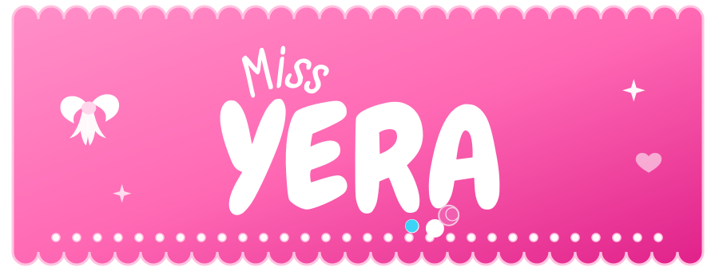

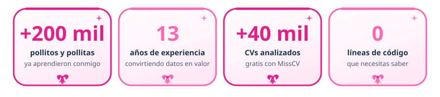


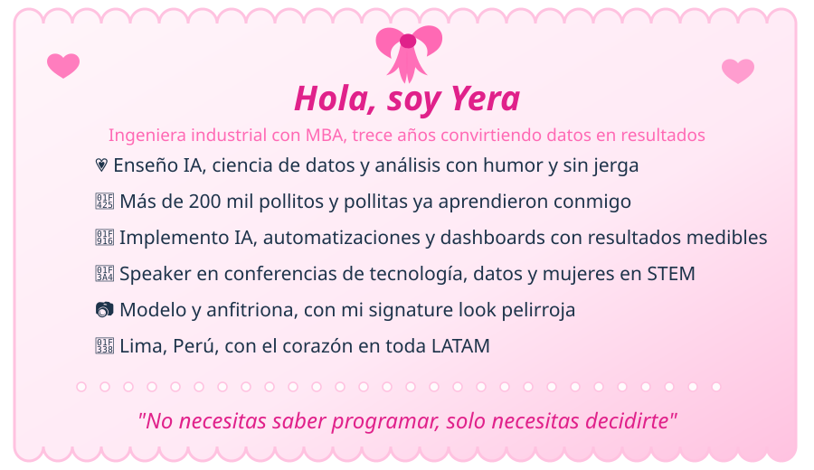

Fundé **Miss Yera** para que la inteligencia artificial deje de dar miedo y empiece a dar resultados, tanto a empresas como a cualquier persona curiosa con ganas de aprender. Y sí, la misma que arma modelos predictivos es la que posa frente a cámara.

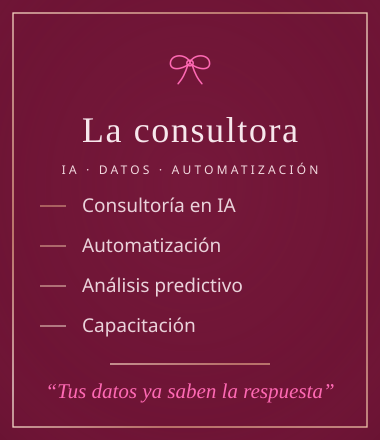 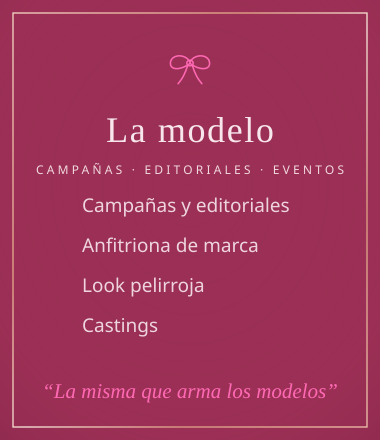

  

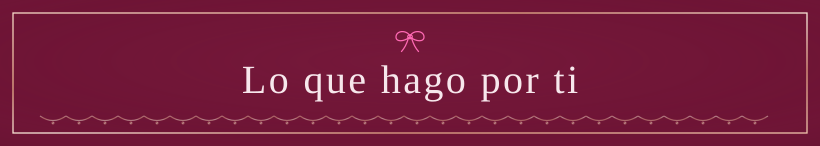

<a href="https://missyera.com/consultoria-ia/">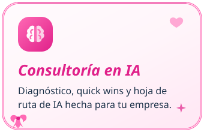</a>
<a href="https://missyera.com/automatizacion-procesos-ia/">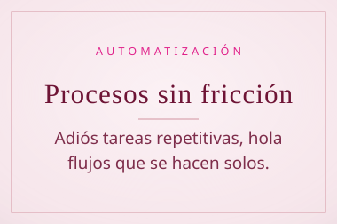</a>
<a href="https://missyera.com/agentes-ia-empresas/">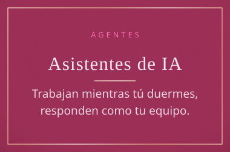</a>

<a href="https://missyera.com/analisis-predictivo-dashboards/">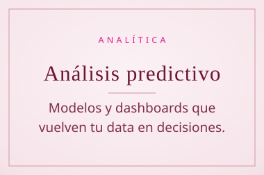</a>
<a href="https://missyera.com/capacitacion-ia-empresas/">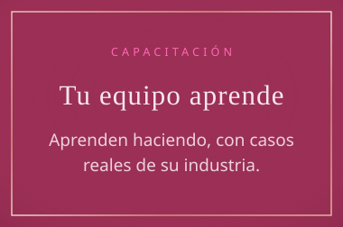</a>
<a href="https://missyera.com/speaker/">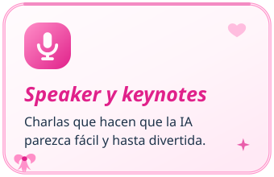</a>

<a href="https://missyera.com/modelo/">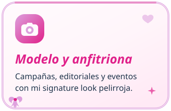</a>

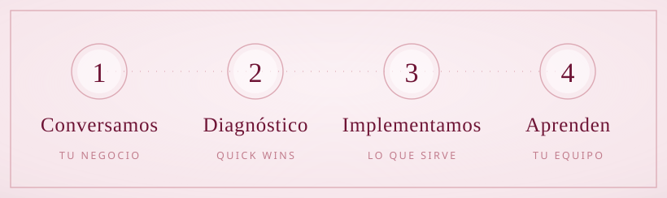

    

    

   

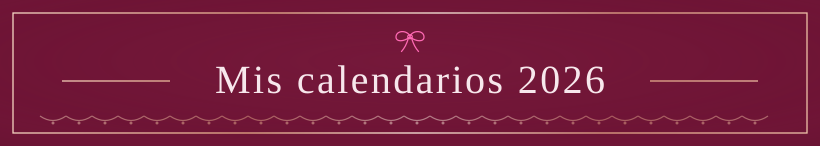

Dos ediciones completas y cero costo. Son mi regalo para mis pollitos 💗

<table>
<tr>
<td width="50%" align="center">

<a href="https://missyera.com/recursos/calendario-miss-yera-2026-1/">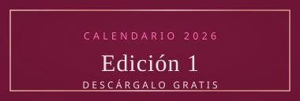</a>
</td>
<td width="50%" align="center">

<a href="https://missyera.com/recursos/calendario-miss-yera-2026-2/">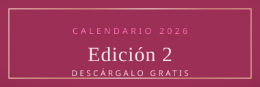</a>
</td>
</tr>
</table>

<a href="https://missyera.com/cursos/full-day-ia/">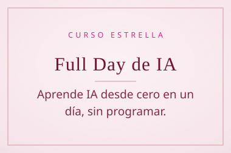</a>

<a href="https://missyera.com/blog/">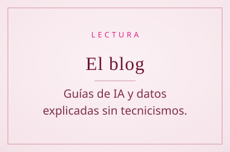</a>

 

Todos los días subo algo de IA, datos y vida real. Elige tu favorita 🎀

<table>
<tr>
<td width="33%" align="center">

</td>
<td width="33%" align="center">

</td>
<td width="33%" align="center">

</td>
</tr>
<tr>
<td width="33%" align="center">

</td>
<td width="33%" align="center">

</td>
<td width="33%" align="center">

</td>
</tr>
</table>

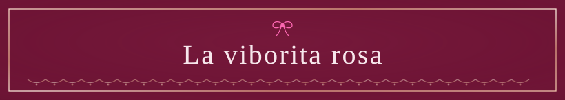

Una viborita se come mis contribuciones todos los días, porque hasta mis bichos son tiernos 🎀

<picture>
<source media="(prefers-color-scheme: dark)" srcset="https://raw.githubusercontent.com/gflores1092/gflores1092/output/snake-dark.svg"/>

</picture>

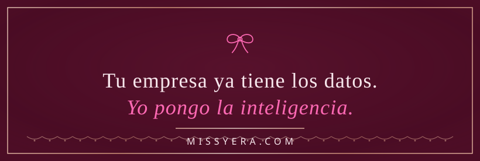

